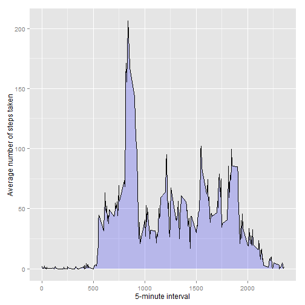
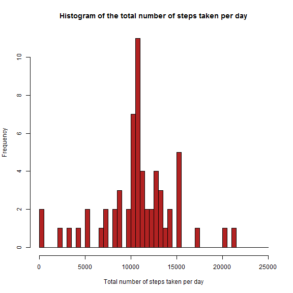

###Loading and preprocessing the data


```r
library(knitr)
library(plyr)
library(data.table)
library(dplyr)
library(ggplot2)
options(scipen=1, digits=2)

setwd("C:\\Users\\Olivia\\OneDrive\\Documents\\Coursera_ReproducibleResearch\\PeerAssessment1")
# Load the data
ActivityData <- read.csv("./repdata_data_activity/activity.csv", stringsAsFactors=FALSE)

# Preprocess the data
# Transform the date into a date format
ActivityData$date <- as.POSIXct(ActivityData$date, format="%Y-%m-%d")
```

###What is the mean total number of steps taken per day 

1. Calculate the number of steps taken per day


```r
ActivityDataSummary <- aggregate(ActivityData[, "steps"], by = ActivityData["date"], FUN=sum, na.rm = TRUE)
colnames(ActivityDataSummary) <- c("Date", "TotalSteps")
```
The first rows of the ActivityDataSummary are provided below:


```
##         Date TotalSteps
## 1 2012-10-01          0
## 2 2012-10-02        126
## 3 2012-10-03      11352
## 4 2012-10-04      12116
## 5 2012-10-05      13294
## 6 2012-10-06      15420
```

2. Make a histogram of the total number of steps taken each day


```r
hist(ActivityDataSummary$TotalSteps, breaks = seq(from = 0, to = 25000, by = 500), col="firebrick", xlab = "Total number of steps taken per day", ylab = "Frequency", main = "Histogram of the total number of steps taken per day")
```

 

3. Calculate and report the mean and median of the total number of steps taken per day

```r
MeanTotalNumberofSteps <- mean(ActivityDataSummary$TotalSteps)
MedianTotalNumberofSteps <- median(ActivityDataSummary$TotalSteps)
```
The mean of the total number of steps taken per day is **9354.23**.

The median of the total number of steps taken per day is **10395**.

###What is the average daily activity pattern

1. Make a time series plot (i.e. type = "1") of the 5-minute interval (x-axis) and the average number of steps taken, averaged across all days (y-axis)


```r
ActivityDataTS <- aggregate(ActivityData[, "steps"], by = ActivityData["interval"], FUN=mean, na.rm = TRUE)
colnames(ActivityDataTS) <- c("Interval", "AverageNumberofStepsTaken")
```
The first rows of the resulting datatable is provided below:


```
##   Interval AverageNumberofStepsTaken
## 1        0                     1.717
## 2        5                     0.340
## 3       10                     0.132
## 4       15                     0.151
## 5       20                     0.075
## 6       25                     2.094
```
The time series plot is created using the following code:


```r
TS <- ggplot(data=ActivityDataTS, aes(x=Interval, y=AverageNumberofStepsTaken)) 
TS <- TS + geom_area(fill="blue", alpha=.2)
TS <- TS + geom_line()
TS <- TS + xlab("5-minute interval") 
TS <- TS + ylab("Average number of steps taken")
TS
```

 

2. The 5-minute interval, which on average across all the days in the dataset contains the maximum number of steps can be determined usgin the following code:
 

```r
maxPos <- which(ActivityDataTS$AverageNumberofStepsTaken == max(ActivityDataTS$AverageNumberofStepsTaken))
maxInterval <- ActivityDataTS[maxPos,1]
```
The 5-minute interval, which on average across all the days in the dataset contains the maximum number of steps, is **835**.

###Inputting missing values

1. Calculate and report the total number of missing values in the dataset (i.e. the total number of rows with NAs)


```r
NATotal <- sum(is.na(ActivityData$steps))
```

The total number of missing values in the dataset is **2304**.

2. Devise a strategy for filling in all of the missing values in the dataset. The strategy does not need to be sophisticated. FOr example, you could use the mean/median for that day, or the mean for that 5-minut interval, etc.

The strategy is to replace the missing valuse by the mean of the 5-min interval

```r
# Identify row indices where we have missing values
NAPos <- which(is.na(ActivityData$steps))
```

3. Create a new dataset that is equal to the original dataset but with the missing data filled in


```r
ActivityData[NAPos, "steps"] <- mean(ActivityData$steps, na.rm=TRUE)
```

The first rows of the new data set are provided below:

```
##   steps       date interval
## 1    37 2012-10-01        0
## 2    37 2012-10-01        5
## 3    37 2012-10-01       10
## 4    37 2012-10-01       15
## 5    37 2012-10-01       20
## 6    37 2012-10-01       25
```

4. Make a histogram of the total number of steps taken each day and calculate and report the mean and median total number of steps taken per day. 


```r
ActivityDataSummary2 <- aggregate(ActivityData[, "steps"], by = ActivityData["date"], FUN=sum, na.rm = TRUE)
colnames(ActivityDataSummary2) <- c("Date", "TotalSteps")
hist(ActivityDataSummary2$TotalSteps, breaks = seq(from = 0, to = 25000, by = 500), col="firebrick", xlab = "Total number of steps taken per day", ylab = "Frequency", main = "Histogram of the total number of steps taken per day")
```

 

The mean and median of the total number of steps taken per day is obtaied using the following code:

```r
MeanTotalNumberofSteps2 <- mean(ActivityDataSummary2$TotalSteps)
MedianTotalNumberofSteps2 <- median(ActivityDataSummary2$TotalSteps)
```
The new mean of the total number of steps taken per day is **10766.19**.

The new median of the total number of steps taken per day is **10766.19**.

Inputting missing data has for direct consequence to increase the mean and median previously computed. This is due to the fact that we now have more data points to work with. Interestingly, both the mean and median are now equal.

###Differences in activity patterns between weekdays and weekends

1. Create a new factor variable in the dataset with tho levels - "Weekday" and "weekend" indicating whether a given date is a weekday or a weekend day. 

This is achieved using the following code:

```r
# Get the day of the week from the data
ActivityData$day <- tolower(weekdays(ActivityData$date))

# Identify if day is a week day or not
ActivityData$daytype <- ifelse(ActivityData$day == "saturday" | ActivityData$day == "sunday", "weekend", "weekday")
```

The new datatable now looks as below:

```
##   steps       date interval    day daytype
## 1    37 2012-10-01        0 monday weekday
## 2    37 2012-10-01        5 monday weekday
## 3    37 2012-10-01       10 monday weekday
## 4    37 2012-10-01       15 monday weekday
## 5    37 2012-10-01       20 monday weekday
## 6    37 2012-10-01       25 monday weekday
```
2. Make a panel plot containing a time series plot of the 5-minute interval (x-axis) and the average number of steps taken, averaged across all weekdays or weekend days (y-axis)

```r
ActivityDataTS2 <- aggregate(ActivityData$steps, by = list(ActivityData$daytype, ActivityData$day, ActivityData$interval), FUN=mean, na.rm = TRUE)
colnames(ActivityDataTS2) <- c("DayType", "Day", "Interval", "AverageNumberofStepsTaken")
```

The corresponding datatable is as follows:

```
##   DayType      Day Interval AverageNumberofStepsTaken
## 1 weekday   friday        0                       8.3
## 2 weekday   monday        0                       9.4
## 3 weekend saturday        0                       4.7
## 4 weekend   sunday        0                       4.7
## 5 weekday thursday        0                       9.4
## 6 weekday  tuesday        0                       0.0
```
The time series plot is created using the following code:


```r
TS2 <- ggplot(ActivityDataTS2, aes(x=Interval, y=AverageNumberofStepsTaken)) 
TS2 <- TS2 + facet_grid(DayType~.)
TS2 <- TS2 + geom_line(color="blue")
TS2 <- TS2 + xlab("5-minute interval") 
TS2 <- TS2 + ylab("Average number of steps taken")
TS2
```

 
